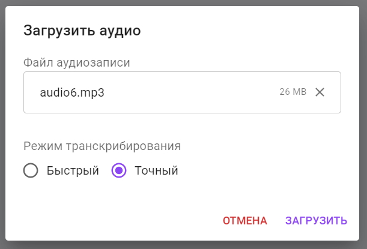

<h1 align="center">MASSitant</h1>

    <em>Интеллектуальный сервис-ассистент методиста</em>

## Содержание

* [Что такое MASSitant?](#что-такое-massitant)
* [Начало работы](#начало-работы)
  * [Авторизация на сайте](#авторизация-на-сайте)
  * [Раздел конспекты](#раздел-конспекты)
    * [Загрузка файлов](#загрузка-файлов)
    * [Карточка лекции](#карточка-лекции)
    * [Редактирование](#редактирование)
    * [Воспроизведение аудио](#воспроизведение-аудио)
    * [Удаление карточек лекций](#удаление-карточек-лекций)
    * [Сохранение обработанных конспектов](#сохранение-обработанных-конспектов)
  * [Раздел справка](#раздел-справка)
* [Обратная связь](#обратная-связь)

---

## Что такое MASSitant?

_MASSitant_ --  это сервис, позволяющий методистам загружать записи лекций для их последующего анализа. На основе аудиофайла алгоритмы формируют текстовый материал с выделением смысловых частей и важных определений. Данный процесс позволяет автоматизировать ручное создание конспектов и снизить нагрузку на преподавателей, а также обеспечить более качественную подготовку материалов для студентов..

## Начало работы

В этом разделе будут рассмотрены основные сценарии использования сервиса.

### Авторизация на сайте

Чтобы начать использовать MASSitant, необходимо пройти авторизацию на сервисе. При переходе на сайт, вы попадаете на главную страницу, если Вы ранее не проходили авторизацию. Если Вы не зарегистрированы, то необходимо сделать это с помощью формы регистрации (кнопка «Регистрация»). Иначе испольуйте форму авторизации (кнопка «Войти»)

### Раздел конспекты

В разделе конспекты хранятся обработанные аудиолекции.

#### Загрузка файлов

Для того, чтобы загрузить новую запись - нажмите на кнопку «Загрузить запись лекции» в правом нижнем углу экрана. В форме загрузки файла вы сможете выбрать один из режимов обработки «Быстрый» и «Точный».
* *Быстрый* - ускоренный метод анализа аудио, может использоваться в тех случаях, когда нужно срочно
              подготовить материал для объемной лекции или курсу лекций, в которых не так критичны ошибки транскрибации.
  
По умолчанию используется «Точный» режим. Анализ в этом режиме соотвествует должному уровню, однако он может занимать чуть больше времени.

#### Карточка лекции

После загрузки файла в разделе «Конспект» появится карточка вашей лекции. На ней будет указана краткая информация - название файла и дата загрузки. При нажатии на карточку - раскрывается более подробная информация о лекции. Здесь содержится 3 основных блока: «Транскрибация», «Глоссарий» и «Краткое содержание». Если аудиозапись длинная и обработка еще не завершена возможно отображение индикатора загрузки.
* *«Транскрибация»* содержит полный текст лекции.
  
    

* *«Глоссарий»* содержит важные термины и определения из лекции (возможно упоминание определений из сторонних источников). Также рядом с каждым определением содержится таймкод упоминания данного термина в аудиолекции. При нажатии на этот код происходит перемотка аудио в нужный момент.

    

* *«Краткое содержание»* включает сокращенную информацию разделенную по смысловым блокам.

    

#### Редактирование

Чтобы отредактировать контент нажмите на кнопку «карандаш» рядом с текстом. После изменений нажмите на кнопку «сохранить».

          
#### Воспроизведение аудио

Если вы хотите вспомнить о чем лекция или проверить правильность обработки, в нашем сервисе для этого предусмотрен встроенный аудиоплеер. Чтобы активировать его - нажмите на кнопку «плэй» рядом с любой из лекций. Снизу страницы появится аудиоплеер, с возможностью перемотки, регулировки звука и переключения лекций.

#### Удаление карточек лекций

Чтобы удалить определенную карточку, перейдите в «Конспект», найдите необходимую карточку и нажмите на значок «урны».

#### Сохранение обработанных конспектов

Чтобы сохранить обработанный конспект (формат docx) - раскройте полную информацию нажатием на карточку, нажмите на кнопку «Скачать» и выберите место загрузки файла.

### Раздел справка

В разделе справка содержится аналогичная информация об использовании сервиса.

## Обратная связь

   
      <em>Никита Семёнов</em>
      •
      <a href="mailto:apexkennys@gmail.com">
         apexkennys@gmail.com
      </a>
    
   
      <em>Николай Филин</em>
      •
      <a href="mailto:nfilin@cs.petrsu.ru">
         nfilin@cs.petrsu.ru
      </a>
    
   
      <em>Евгений Харичев</em>
      •
      <a href="mailto:ge01nia85@gmail.com">
         ge01nia85@gmail.com
      </a>
    
   
      <em>Никон Подгорный</em>
      •
      <a href="mailto:podgorny.nikon@yandex.ru">
         podgorny.nikon@yandex.ru
      </a>
    
   
      <em>Арсений Фомин</em>
      •
      <a href="mailto:fomin@cs.petrsu.ru">
         fomin@cs.petrsu.ru
      </a>
   

